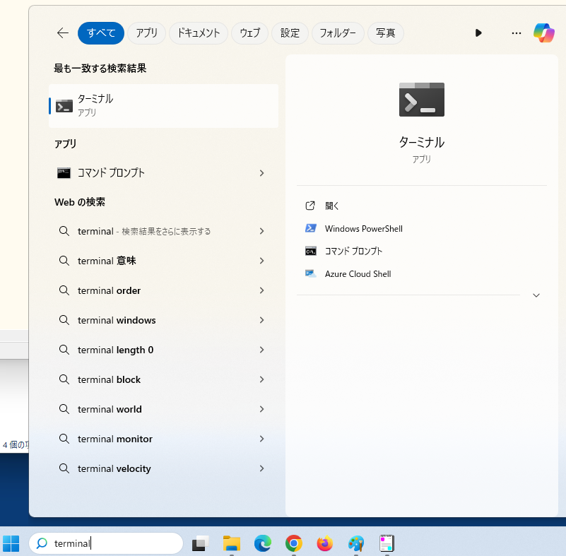
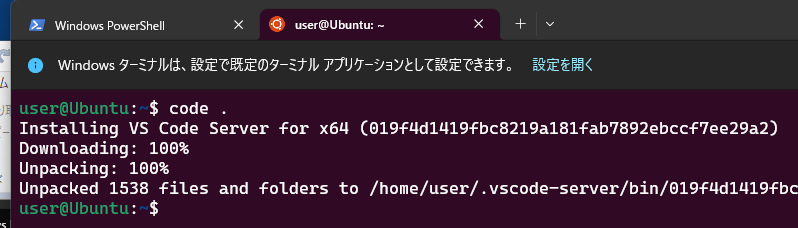
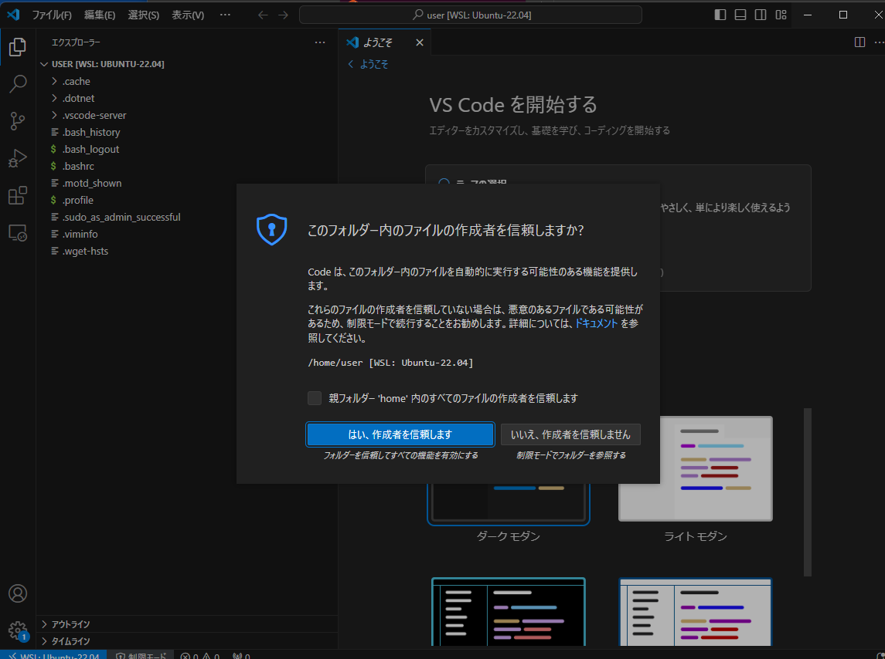
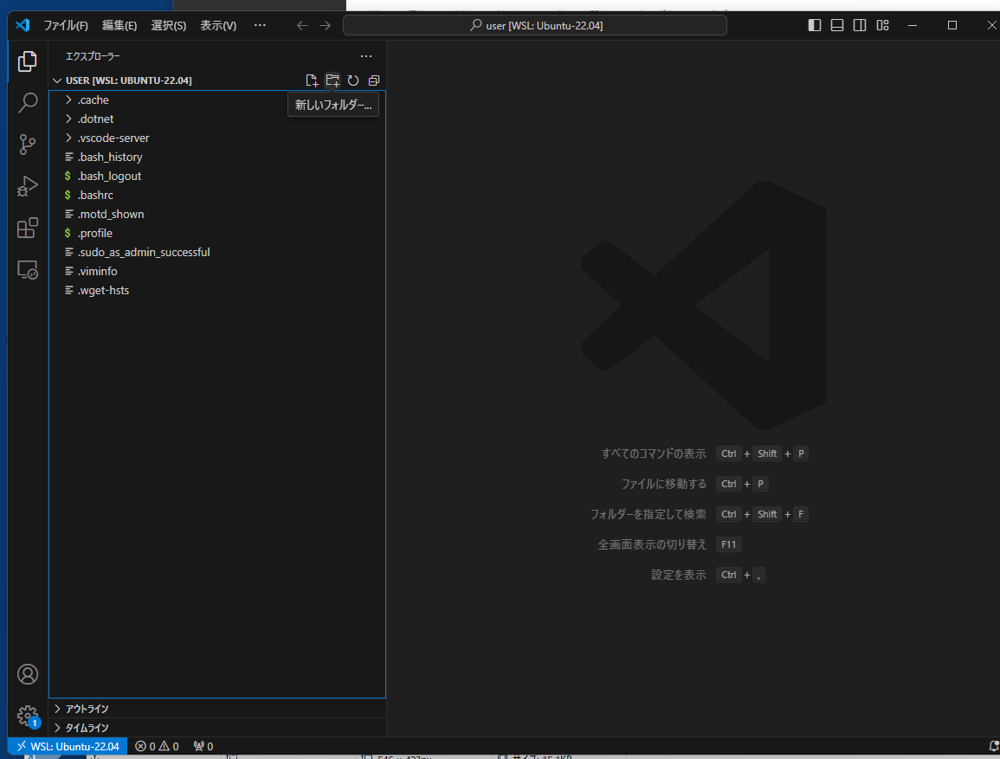
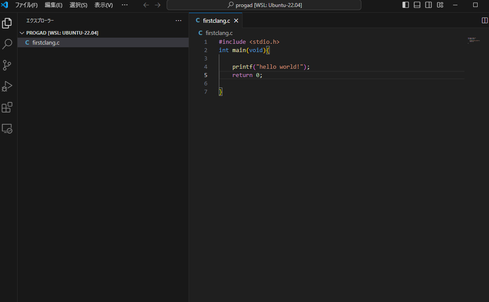

# progad

# wsl+ubuntusの利用方法 (w203演習室端末） 

## 演習室端末へのログイン
   * 各学生の学籍番号でサインインするのではなく、ローカルアカウント（すべて同じアカウントです）でのサインイン
     * ローカルアカウント
     * アカウント：.\user　（ドット￥user）
     * パスワード：授業時に知らせます　　　　　　　　　

   * ローカルアカウントでのサインインの場合の制限
     1. プリントアウトができない
     2. Office製品（Excel・Word・PowerPoint）を使用する場合は各自のアカウントでサインインが都度必要（PCの電源を切るまではサインインした状態が有効）
     3. ファイルサーバーHOMEへのアクセスについては、デスクトップ上にショートカットからHOMEへアクセスする
     4. サブシステムLinuxで作成したファイルフォルダはPC再起動時に初期化され削除されてします。（したがって、各自のネットワークドライブhomeに保存しておく必要がある）

## windowターミナルを起動する
windowsロゴからterminalと検索して起動する

## ubuntuターミナルを選択する


##  VScodeを開きソースファイルを作成する
Ubuntuターミナルで code ␣.(ドット)　と入力する
```
code .
```

VScode 起動直後の画面


-  「信頼する」をクリックしてよい
-   「ようこそ」タブは×で消してよい
  
 VScode の画面

新しいファイル、新しいフォルダのアイコンをクリックすると、ファイルやフォルダが新規作成される

フォルダ「progad」を新規作成し、その中に入り、ファイル「firstclang.c」を作成しコード入力した画面


## c言語ソースのコンパイルと実行

